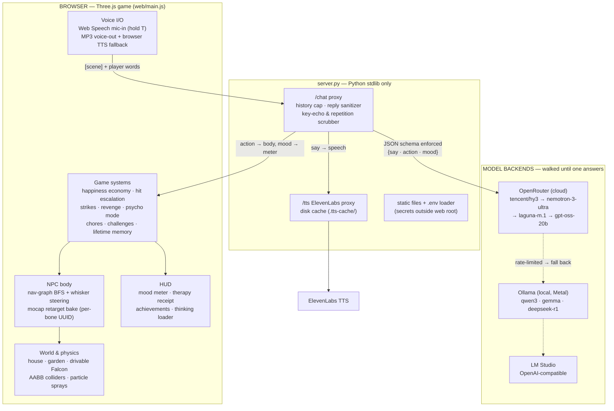
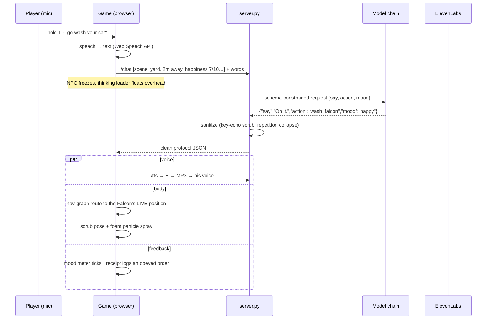

# tiny-gta — Architecture

A GTA-style sandbox where the only NPC is a live LLM with a body. Voice in,
voice out, full physical obedience (until you push him too far). No game
engine, no bundler, no npm packages, no Python dependencies.

Shareable visual version of this doc (same diagrams, styled):
published as a Claude artifact — ask Claude for the link, or screenshot below.

## The whole machine



## One voice command, end to end



## The brain protocol

Everything the model does flows through one JSON object:

```json
{"say": "On it — she deserves a spa day.", "action": "wash_falcon", "mood": "happy"}
```

- `say` → spoken aloud (ElevenLabs, cached; browser voice fallback) + speech bubble
- `action` → one of ~37 verbs the body executes (`jump:4`, `goto:car`, `drive`,
  `picket`, `selfie`…) — a deterministic command-mapper backstops the model so
  clear player orders always reach the body
- `mood` → the status line

The protocol is **engine-agnostic**: rebuild the world in Unreal/Unity and the
same server + persona plug straight in.

## Code map

| File | Owns |
|---|---|
| `web/main.js` | Entire game: world build, colliders, nav graph, animation retargeting, player/NPC controllers, car physics, voice I/O, economy, retaliation, memory, HUD |
| `web/persona.js` | The NPC's mind — system prompt builder, action list, behavior rules (obedience, hit escalation, psycho mode, dev-therapist voice) |
| `web/index.html` | UI shell: HUD, meters, panels, overlays, importmap |
| `server.py` | `/chat` (backend chain + sanitizer), `/tts` (ElevenLabs + cache), static serving, `.env` loader |
| `web/assets/anim/` | Ready Player Me mocap library (CC), retargeted onto any rig at boot |
| `web/vendor/` | three.js r160 + loaders + postprocessing (bloom), vendored — works offline |

## Reliability layers (why he never breaks character)

1. **JSON schema decoding** at the backend (not loose "valid JSON" mode — the
   actual fix for small-model key-echo loops like `"say say say…"`)
2. **Repetition penalties** (`repeat_penalty` on Ollama, `frequency_penalty` on OpenRouter)
3. **Server-side sanitizer** — strips think-tags, key echoes, repeated-word runs
4. **Client-side parser** — same defenses, independent
5. **Model fallback chain** — 4 cloud models → local Ollama → LM Studio
6. **Deterministic command mapper** — obeys even if the model waffles
7. **Procedural animation fallbacks** — every action has a body response even
   with zero animation clips

## Animation pipeline

Characters come from anywhere (three.js samples, Mixamo FBX with duplicate
skeletons, custom GLBs). At boot, a **world-space delta-from-bind retarget**
bakes the mocap library onto whatever skeleton loaded: per-frame, per-bone,
top-down so parent transforms are never stale, tracks bound by bone UUID so
duplicate-name chains (body/hoodie/hair) stay in sync. Verified headlessly by
asserting posed body geometry (head above hips, feet on ground) across clips
and timestamps before any of it shipped.
